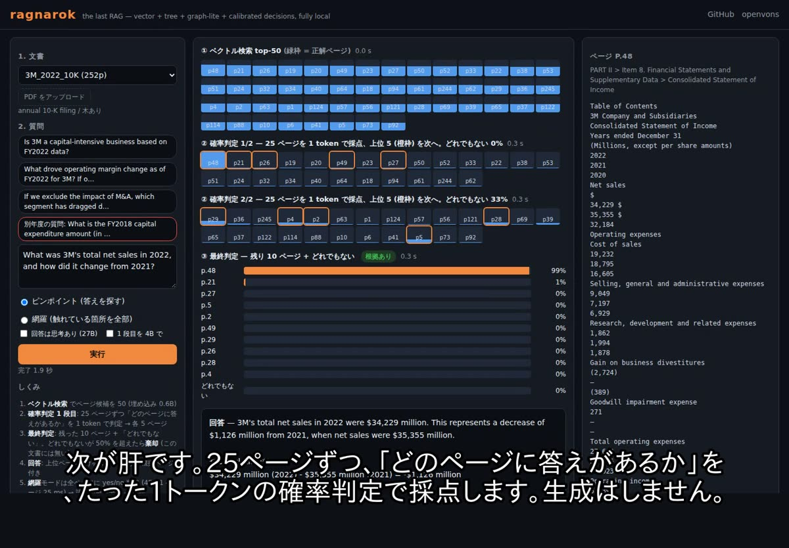
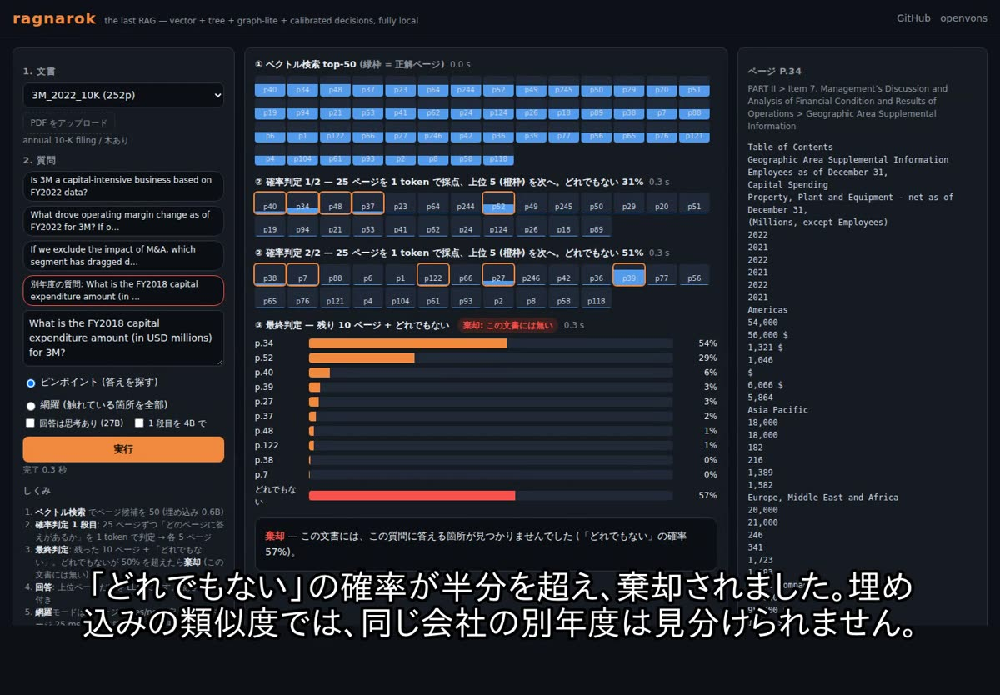
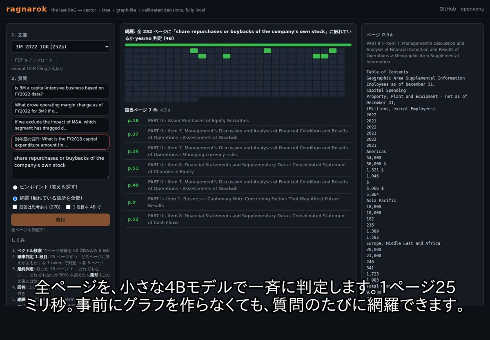

# ragnarok — the last RAG

[English] · [日本語 (Japanese)](README_ja.md)

**Vector × tree × graph-lite × calibrated decisions. Fully local (one GPU).**
Built on [openvons](https://github.com/genai-craft/openvons), the finite-candidate decision engine (Jev-style calibrated choices).

**Live demo: https://ragnarok.openvons.com** · Full video (2.7 min, Japanese narration & subtitles): [mp4 on the demo site](https://ragnarok.openvons.com/static/ragnarok_demo_v2.mp4) · [release asset](https://github.com/genai-craft/ragnarok/releases/latest)


| 50 candidates → 25+25 → 10, one token each | "none of these" ≥ 50% → abstain | every page judged, 25 ms each |
|---|---|---|
|  |  |  |

Most RAG stacks pick one paradigm — vectors, a table-of-contents tree (PageIndex), or a knowledge graph (GraphRAG) — and each loses somewhere.
ragnarok uses **vectors for breadth**, **a document tree for structure**, **query-time sweeps instead of a pre-built graph for coverage**, and — the part that is new —
**1-token probability decisions** (not generation) to choose among candidates at every step. That gives you three things the others don't:

1. **Precision at the same cost**: re-rank 50 candidates with three 1-token forwards instead of a generative re-ranker → FinanceBench evidence hit@5 **0.67 → 0.88**.
2. **Abstention that actually works**: a calibrated "none of these" option. When the answer is not in the document, it says so — even when the document *looks* right (same company, different fiscal year: AUROC **0.96** vs 0.73 for embedding similarity).
3. **Coverage without an index of extractions**: "every place this topic appears" is a yes/no decision per page (25 ms each on a 4B model) → recall **0.93** vs 0.57 for vector top-10.

## Results (all measured, all local: Qwen3-Embedding-0.6B + Qwen3.8-27B-AWQ-INT4 / Qwen3-4B on vLLM)

FinanceBench open-source set (150 questions, 84 10-K filings, 12,013 pages). Answerer and judge are the same local 27B for every row, so compare rows, not absolute values.

| Retrieval | evidence hit@1 | evidence hit@5 | answer accuracy |
|---|---|---|---|
| Vector search (page embeddings) | 0.36 | 0.67 | 0.47 |
| + cross-encoder re-rank (bge-reranker-v2-m3, top-50) | 0.28 | 0.61 | 0.46 |
| + generative listwise re-rank (RankGPT-style, 27B, top-25) | 0.57 | 0.81 | 0.59 |
| PageIndex-style (show the tree, generate node ids) | 0.39 | 0.58 | 0.45 |
| **ragnarok: vector top-50 → 2-stage 1-token decisions (25+25 → 10 → 5)** | 0.59 | **0.88** | **0.66** |
| same, answerer with thinking | 0.59 | 0.88 | **0.73** |

Abstention — ask each question against a *different* document and look at the "none of these" probability:

| Decoy document | embedding-similarity threshold AUROC | ragnarok "none" probability AUROC | at none>0.5: false reject / reject |
|---|---|---|---|
| another company's 10-K | 0.993 | 0.985 | 3% / 90% |
| **same company, ≥3 years apart** | **0.731** | **0.960** | **1% / 79%** |

Coverage — "all pages that discuss X" (6 filings × 8 topics, oracle = 27B page labels):

| Method | recall | precision | decision calls |
|---|---|---|---|
| vector top-10 | 0.57 | 0.48 | 0 |
| keyword match | 0.80 | 0.57 | 0 |
| vector top-50 → 4B yes/no | 0.82 | 0.66 | 50 |
| **every page → 4B yes/no (sweep mode)** | **0.93** | 0.61 | ~155 (≈4 s per filing) |

Full tables, what did *not* work (tree navigation on 10-Ks, distilling the re-ranker into a 4B head), and the qualitative comparison with GraphRAG / PageIndex / vector RAG: [docs/comparison.md](docs/comparison.md), [bench/README.md](bench/README.md).

## How it works

```
question ──► page embeddings (top-50)
         ──► decision ×2: "which of these 25 pages holds the answer? / none"  → top-5 each
         ──► decision: "which of these 10? / none"  → pages + P(none)
         ──► P(none) ≥ 0.5 ? abstain : answer from those pages (with citations)
sweep:   every page ──► "does this page discuss X? yes/no" (4B, 25 ms) ──► all hits ──► summary
```

Decisions are made with openvons' `LLMBackend` (guided choice + first-token logprobs on any OpenAI-compatible server): one forward pass returns a full probability distribution over the options.

## Quick start

```bash
git clone https://github.com/genai-craft/ragnarok && cd ragnarok
uv venv && uv pip install -e ".[demo]"
# model servers (vLLM): 27B judge/answerer on :8310, 4B fast judge on :8311 — edit GPUs/models in the script
JUDGE_GPU=0 FAST_GPU=0 scripts/serve_models.sh
python - <<'PY'
import asyncio
from ragnarok.engine import Engine
eng = Engine()                                   # Qwen3-Embedding-0.6B + the two vLLM servers above
ix = eng.index_pdf("your.pdf")                   # pages + embeddings + layout tree, no LLM
async def main():
    r = await eng.retrieve(ix, "What was total revenue in fiscal 2022?")
    print(r.pages, r.none_final, r.abstain)      # pages (0-based), P(none), abstain?
    print(await eng.answer(ix, "What was total revenue in fiscal 2022?", r.pages, think=True))
    hits = await eng.sweep(ix, "share repurchases")   # {page: P(yes)} for every page
asyncio.run(main())
PY
python -m examples.demo.server --port 8608     # the web demo
```

The demo takes **PDF, DOCX, PPTX, HTML, TXT and Markdown** (non-PDF files are split into sections/slides instead of pages), shows each decision stage with probabilities, previews the cited PDF page, streams the answer, and has a sweep mode.

Smaller setups: the 4B alone works for everything (re-rank hit@5 0.77 instead of 0.88); any OpenAI-compatible server that returns `logprobs` and supports guided choice can be the judge.

## What this is not (yet)

- The tree is a helper, not the core: on FinanceBench-type questions (numbers inside tables) tree navigation lost to embeddings, even with LLM summaries on every node. It stays for structure-heavy documents (laws, contracts) and is measured separately.
- Relation questions ("who is connected to X") are not measured; coverage/aggregation is. A lazy graph (edges verified by decisions at query time) is the plan.
- Japanese works end-to-end (demo includes a Japanese white paper); Japanese benchmarks are coming (EDINET securities reports).

## License

Apache-2.0 — free to use, modify and redistribute **with attribution**: keep [LICENSE](LICENSE) and [NOTICE](NOTICE), and credit "ragnarok — https://github.com/genai-craft/ragnarok" ([CITATION.cff](CITATION.cff)).
ragnarok is independent of TypeSafe AI and its product Jev; it builds on openvons, an independent implementation of Jev-style calibrated decisions.
